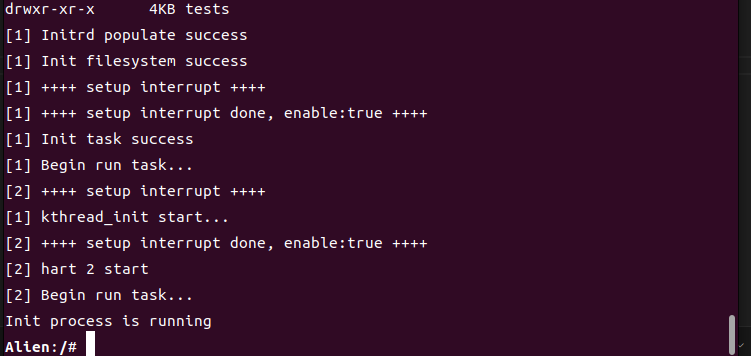
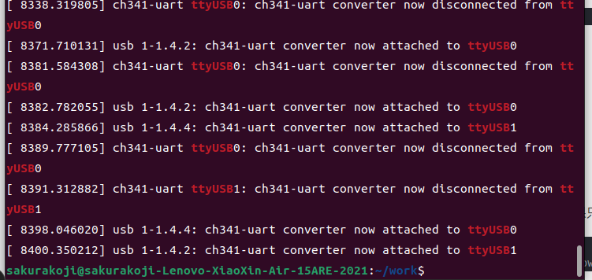

## 星光二板子上使用异步串口驱动

默认的 UART 使用的GPIO引脚为 GND、GPIO5(UART TX) 和 GPIO6(UART RX)，对应的引脚号为6、8、10

在[用户手册]((https://doc.rvspace.org/VisionFive2/PDF/VisionFive2_40-Pin_GPIO_Header_UG.pdf))的第8章中指出最多支持6路UART，将一些未使用的 GPIO 配置为 UART，需要修改 dts 文件。


### 步骤
+ [x] Alien 双核启动
+ [ ] 新创建串口并输出结果
+ [ ] 异步启动
+ [ ] 异步串口


##### Alien 双核启动
编译内核时使用 `make vf2 VF2=y SMP=3` 即可，其余启动流程和正常相同




#### 新创建串口并输出结果
+ 修改 Visionfive-v2.dtb

先使用 `dtc -I dtb -O dts -o jh7110-visionfive-v2.dts jh7110-visionfive-v2.dtb` 反汇编 dtb 文件为 dts，然后再在 dts 文件中加入串口，并配置gpio控制引脚。


```
aliases {
        // ...
		serial0 = "/soc/serial@10000000";
		serial1 = "/soc/serial@10010000";   <=====
		serial3 = "/soc/serial@12000000";
        // ...
    };


serial@10010000 {
    compatible = "snps,dw-apb-uart";
    reg = <0x00 0x10010000 0x00 0x10000>;
    reg-io-width = <0x04>;
    reg-shift = <0x02>;
    clocks = <0x1b 0x94 0x1b 0x93>;
    clock-names = "baudclk\0apb_pclk";
    resets = <0x1c 0x55 0x1c 0x56>;
    interrupts = <0x21>;
    status = "okay";                    <====
    pinctrl-names = "default";          <====    
    pinctrl-0 = <0x60>;                 <====
};


uart1-pins {
    phandle = <0x60>;

    uart1-pins-tx {
        starfive,pins = <0x3f>;
        starfive,pinmux = <0x2ac 0x1e 0xc0000000 0x00>;
        starfive,pin-ioconfig = <0x07>;
        starfive,pin-gpio-dout = <0x15>;
        starfive,pin-gpio-doen = <0x00>;
    };

    uart0-pins-rx {
        starfive,pins = <0x3c>;
        starfive,pin-ioconfig = <0x09>;
        starfive,pin-gpio-doen = <0x01>;
        starfive,pin-gpio-din = <0x0e>;
    };
};
```

修改后使用 `dtc -I dts -O dtb -o jh7110-visionfive-v2.dtb jh7110-visionfive-v2.dts` 重新编译 dts 文件
 

+ 接线后探测是否有两个串口tty

使用 `sudo demsg | grep ttyUSB` 命令查看两个设备是否都能被探测到。

刚开始发现只有一个，检查后发现新买的 tty转USB 设备没被探测到。摸索一番后发现没调电压。调完电压以后能够正常探测到两个串口设备。




+ 在新创建的核上创建一个串口对象，并向该串口输出字符

发现在第二个核创建新的 Uart8250对象时内核崩溃，查看崩溃时的backtrace，是由于对串口 MMIO 对应位置进行读写操作时，触发了 LoadPageFault。检查后发现，是由于新创建的串口没有硬编码 MMIO 地址，在内核初始化 MMIO 部分时，没有为新的串口分配地址空间。

修改后，再次编译内核后能够正常初始化串口并对串口上的寄存器进行读写。但对串口进行一次写操作发现会发现串口在等待中断。

sudo minicom -D /dev/ttyUSB0 
sudo minicom -D /dev/ttyUSB1

感觉像是设备树修改错误，在新创建的串口上没有相应的输出。


#### 相关资料
+ [GPIO引脚分布信息](https://doc.rvspace.org/VisionFive2/Datasheet/VisionFive_2/gpio_pin_assig.html)
+ [昉·星光 2 40-Pin GPIO Header用户手册](https://doc.rvspace.org/VisionFive2/PDF/VisionFive2_40-Pin_GPIO_Header_UG.pdf)
+ [jh7110-starfive-visionfive-2.dtsi](https://github.com/starfive-tech/linux/blob/JH7110_VisionFive2_devel/arch/riscv/boot/dts/starfive/jh7110-starfive-visionfive-2.dtsi)