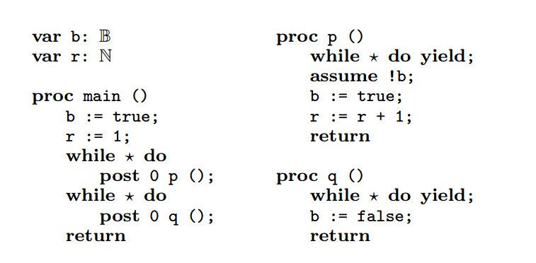

原文标题：Asynchronous Programs with Prioritized Task-Buffers

原文链接： https://dl.acm.org/doi/pdf/10.1145/2393596.2393652

## 具有优先任务缓冲区的异步程序

#### 摘 要

我们认为异步软件系统的算法分析是构建可靠软件的一种手段。设计这种分析的一个关键挑战是确定一个并发模型，该模型不会在实际系统中引入不可行的行为，不会在实际系统中排除实际可行的行为，并将具有挑战性的特性隔离出来，以便集中分析。

在现有的异步软件的指导下，我们提出了一种并发模型，该模型通过任务优先级和多任务缓冲区丰富了现有的串行任务-缓冲区异步模型[29]。我们的模型允许非串行执行：具有高优先级的任务抢占低优先级的任务，并且从不同缓冲区提取的任务可以自由地交错执行。对这些特性进行建模使得分析算法能够检测出异步程序中由于缓冲区间交错和任务中断而导致的未被捕获的编程错误，同时正确忽略由于违反优先级顺序的不可行的执行而导致的假错误。

除了更精确地对现实世界的系统进行建模之外，我们的并发模型还启发出了一种新型分析算法的设计。给定参数 $ K_1, K_2 \in N $ 限制缓冲区间任务交错和缓冲区内任务重排序，我们给出了将代码变为串行代码的代码转换方式，通过这种方式我们可以通过现成的程序分析工具对代码进行分析。对于任何给定的参数值，我们得到的串行程序能够编码所有可能行为的一个子集，并且在两个参数都接近无穷大的情况下，得到的串行程序能够编码所有可能的行为。我们通过对一个原型实现进行实验来证明我们的技术的可行性。我们的原型可以与最先进的并发程序验证工具相媲美，并且能够在简化的Windows设备驱动程序代码中正确识别错误，同时忽略不可行的执行。

**范畴和学科描述**：D.2.4 软件工程：软件/编程的验证   D.2.5 软件工程：测试和调试

**通用术语**： 算法，可靠性，测试，验证

**关键词**： 并行，异步编程，串行化

#### 1. 引 言

交互式计算机系统的用户希望应用程序对用户操作的反应时延尽可能短。例如，当与图形用户界面（GUI）交互时，尽管应用程序可能正在执行长时间的计算，但用户每次单击鼠标和击键都希望得到即时反应。类似地，用户会期望 web 服务器立即回复每个HTTP请求，尽管服务器可能正在处理数千个并发请求。为了确保这种低延迟行为，运行这些应用程序的现代操作系统提供了中断和对应用程序顺序控制流进行并行化的机制。硬件事件初始化中断服务例程，该例程将中断当前执行进程，例如，确保每个按键输入都会立即传达给应用程序。在多处理器系统中，逻辑上不相关的任务是并行执行的，例如将不同的HTTP连接的处理任务划分到几个核或处理器上。

传统的这种响应式软件系统被设计为共享内存的多线程程序：一组软件线程（每个线程本质上都表现为一个递归的顺序程序）并发执行，交错地对共享内存进行读写访问。虽然状态简单，但这种并发模型对于必须通过添加同步（如原子锁定指令）来预测和防止不希望的线程交互的程序员来说是复杂的。在考虑到过度同步（例如，通过单个全局锁保护所有事务）会阻碍交互性并破坏并行化的机会时，这项工作尤其困难。此外，由于底层运行时系统的性能通常很大程度上取决于系统范围内并发线程的数量，因此程序员还必须考虑外部因素，例如运行时平台和其他并发执行程序的存在。

针对多线程的缺点，响应式软件系统的程序员越来越多地采用基于串行任务缓冲区的“异步编程”范式。从本质上讲，程序员将总的计算任务划分为短期运行到完成的任务，这可能会创建额外的任务来异步执行。每个任务在创建时都被放入任务缓冲区中，并且运行时系统确保来自同一缓冲区的任务是可顺序执行的。近年来，桌面应用程序、服务器和嵌入式系统都广泛采用了这种范式。现代web浏览器的 Javascript 引擎[12]，MacOS 和 iOS 中的 Grand Central Dispatch [2]， Linux 的工作队列[30]，. NET 中的异步[22]，以及 Windows 内核中的延迟过程调用[23]都是基于异步编程。即使在单处理机的配置（即没有任何并行性）中，像 Node.js[7] 这样的异步框架也被广泛用于设计极具可伸缩性的（web）服务器。

尽管任务缓冲区提供了高度抽象，但构建可靠的无差错程序仍然很困难。因为程序员可能需要将长时间运行的任务 t 重组为一系列短时间运行的任务 $t_1, ..., t_i$, 在 $t_j$ 和 $t_{j+1}$ 之间执行的其他任务可能会干扰 $t$ 所预期的原子计算。此外，跨多个任务缓冲区执行的任务（例如，在多核处理器上）不能保证顺序执行，并且可能干扰共享内存访问。因此，算法形式推理是防止代价高昂的编程错误的可靠措施。

为了设计有效的程序分析，我们提出了一个规范的模型来对现实世界中响应式系统的并发性进行建模。在我们的模型中，每个任务都有一个相关的优先级级别，每个任务从多个任务缓冲区执行后再提交新的任务到多个任务缓冲区。来自每个缓冲区的任务一个接一个地依次执行，并将新任务提交给到从一开始分配给它们的同一个缓冲区，但是不同缓冲区的任务可能会交叉执行。（最初，每个任务缓冲区至少包含一个初始任务。）当一个任务完成时，将从缓冲区中取出一个优先级最高的挂起任务并开始执行。在任何时刻，当任务 $t_1$ 提交了更高优先级的任务 $t_2$ 时，$t_1$ 被挂起以执行$t_2$。当没有更高优先级的任务剩余时， $t_1$ 恢复执行。优先级级别和任务缓冲区的数量是有限的，并且是静态确定的。此外，从一个任务缓冲区取出的任务可能不会将任务提交到另一个任务缓冲区；唯一的缓冲区间通信是通过共享内存进行的。

我们的模型扩展了 Sen 和 Viswanathan [29] 的单任务缓冲区模型，以更准确地对现实世界中响应式异步程序的并发性进行建模 [2,22,23,30]。在不考虑优先级的情况下，以前的模型保证在实际系统中永远不会出现的打破优先级顺序的执行。通过考虑单个任务缓冲区，前人的模型排除了实际系统中可能出现的不同缓冲区间任务的交错执行。但在形式验证的情况下，前者会导致错误地检测到错误，而后者导致存在未捕获到的错误。

虽然典型的程序分析问题对于没有 [11,29] 甚至有任务优先级 [3] 的单任务缓冲区模型来说是可确定的，但正交扩展到多个交错的任务缓冲区会使一个问题无法确定：递归多线程程序 [28] 足够容易被建模。尽管如此，我们认为多任务缓冲区异步模型非常重要，足以与多线程模型区分开来，原因有二。首先，将具有多个优先级任务缓冲区的异步程序编码为多线程程序需要添加额外的状态和同步机制，以确保（a）相同缓冲区的任务不会交错执行，（b）每个缓冲区中只有最高优先级的任务可以执行。使用通用同步机制对这些约束进行编码忽略了更具声明性的程序结构，并导致低效的程序探索（如我们的实验所示）。其次，通过利用实际程序中并发性的内涵结构，我们可以为优先级程序探索获得有用的启发式方法。例如，在上下文边界的前提下 [24,26] ，我们通过探索相对较少的任务缓冲区间交替执行或相对较少的缓冲区内任务重排序（不直接限制执行的任务数量）的程序执行而受益。

本着开发异步程序结构的精神，我们将参数化程序分析简化为顺序程序分析。分析中参数 $K_1$ 和 $K_2$ 分别限制了不同缓冲区任务间的交错执行次数（$K_1$）和同一缓冲区任务间的重排序次数（$K_2$）。当我们增加 $K_1$（或 $K_2$），我们的分析探索了越来越多的缓冲区间任务交错执行（或越来越多的缓冲区内任务重排序）的情况；当 $K_1$ 和 $K_2$ 都趋近于无穷时，我们的编码模拟了所有可能有效的执行。对于任何给定的参数值，我们简洁地将一组有限的异步执行编码为非确定性顺序程序进行执行，改非确定性的顺序程序具有多项式数目（使用 $K_1$ 和 $K_2$ 表示）的共享变量附加副本。我们的编码是按照现有的顺序程序缩减的原则进行组合的 [4,8,15,18] ，因为每个任务缓冲区的执行都是在与其他任务缓冲区隔离的情况下进行的，并且任务缓冲区本身没有显式表示。这样的组合性避免了通过保持其他缓冲区任务的本地状态，甚至通过显式表示单个任务缓冲区的内容而产生的组合爆炸。

规约分两步进行。首先，我们将具有多个任务缓冲区的异步程序规约为具有单个任务缓冲区的异步程序，同时保留任务优先级（第4节）。我们通过引入了共享变量的 $K_1$ 份拷贝的代码到代码转换方式来实现这一点。每个副本存储一份任务在被其他缓冲区的任务抢占后恢复的值；这些值最初是估计出来的，随后被验证的。因此，通过切换到下一个共享变量副本，可以在本地模拟与其他任务缓冲区的交错。在第二步（第5节）中，我们将具有任务优先级的单缓冲区异步程序规约为顺序程序。我们再次通过代码到代码的转换来实现这一点。在这种转换中，我们仍然为每个优先级级别引入了共享变量的副本。由于我们的转换的目标是顺序程序，而没有显式表示任务缓冲区，因此每个异步任务提交都被粗略地翻译为同步过程调用。由于低优先级任务的任务提交不允许立即执行，因此我们使用额外的共享变量副本来汇总它们的执行，将它们的执行效果推迟到之后。

本文的贡献如下:

+ 受我们对现实世界中的桌面、服务器和嵌入式响应式软件系统等相关研究的启发（第2节），我们提出了一个并发模型（第3节），该模型自然而准确地捕获了对并发行为进行建模。

+ 我们提出了一种增量程序分析技术，通过两步规约可以转化为顺序程序分析（第4节 和 第5节）。

+ 我们证明了我们的程序分析在实践中相对容易实现并且有效。我们的原型实现能够发现异步C程序中的错误（第6节），也不会不精确地报告现有异步模型的分析有可能检测到的错误，

通过将异步程序转换为顺序程序，我们使得将许多现有的顺序程序分析工具用于（几乎近似的）异步程序分析中。我们使用的转换与程序中存在的数据类型无关，因此能够针对支持任意数据域的分析，例如，布尔程序、带有整数或列表的程序等。

#### 2. 实践中的异步

为了构建实用的验证和调试工具，我们必须指定我们希望建模的并发程序行为。为了更好地理解为什么现有的正式并发编程模型是不够的，我们调研了两个现实世界的应用程序：Windows操作系统中的硬件-软件交互，以及 Apache web 服务器中的异步多处理。

##### 2.1 Windows操作系统中的硬件-软件交互

确保 Windows 内核中高性能硬件交互的主要机制是 优先中断级别。在接下来的讨论中，我们将关注优先级递减顺序的三个级别 DEVICE_LEVEL，DISPATCH_LEVEL 以及 PASSIVE_LEVEL。

在 DEVICE_LEVEL 上，运行软件“中断服务例程”（ISRs）。连接设备到处理器核心的布尔值“中断线”触发固定中断服务例程：当核心的中断线被触发，并且中断服务例程当前没有处于运行状态时，当前运行的代码就会被中断以执行终端服务例程。由于 DEVICE_LEVEL 的中断服务例程阻止执行任何其他代码，包括调度器，因此 DEVICE_LEVEL 的中断服务例程应该在很短的时间内执行，将剩余的计算委托给异步的“延迟过程调用”（DPC）。Windows 内核维护一个挂起的延迟过程调用和Windows 调度器所进行的周期性调用的调用队列，在所有的调用完成前这些调用会在 DISPATCH_LEVEL 上逐个执行，直到队列为空。普通的应用程序运行在 PASSIVE_LEVEL，只在DPC队列为空时才会执行这些应用程序。与 DEVICE_LEVEL 代码一样，PASSIVE_LEVEL 上的延迟过程调用不应该休眠或阻塞等待 I/O；相反，它们应该通过在另一个延迟过程调用队列中等待，或者将工作委托给 PASSIVE_LEVEL 线程来继续推迟未来的工作。尽管延迟过程调用保证不会与同一核心上的其他延迟过程调用或应用程序线程交织，但延迟过程调用可以与中断服务例程、延迟过程调用、Windows 调度程序和其他核心的线程并发执行。

除了带来响应性之外，优先级方案还为设备的共享数据提供同步。由于 PASSIVE_LEVEL 以上的代码是自动执行的，不会被同级或更低级别的代码抢占，因此从 PASSIVE_LEVEL 提升到DISPATCH_LEVEL 也将同步单核上的设备访问。

我们的模型可以精确地模拟 Windows 的这些方面，方式就是通过为每个任务分配三个优先级中的一个，并将来自不同核的代码划分到不同的任务缓冲区。为了模拟硬件和软件之间任意交叉运行的交互，我们可以为单个旋转硬件模拟任务指定一个单独的任务缓冲区。请注意，忽略优先级可能会在使用基于级别的同步保护的设备数据上导致错误的数据竞争错误，而忽略多个缓冲区将会由于在不同的核（或硬件）之间交错运行而错过真正的错误。

##### 2.2 Apache 中通过大中央调度的多处理

在最近发布的软件补丁中，曾经多线程的 Apache web 服务器被重新设计为使用 libdispatch 并发框架的异步程序[1]。在更新后的体系结构中，应用程序启动时会创建许多并发执行的连接侦听器对象，每个对象维护一个单独的传入连接请求队列。每个侦听器通过创建一个新的连接对象来处理连接请求，该对象除了存储与给定客户机连接相关的所有数据外，还维护与该连接相关的任务队列。低级别的网络套接字上的客户端活动会触发附加的连接处理任务，这些任务将被放置在队列中。由周期性计时器和服务器响应触发的任务也被放在队列中。重要的是，尽管负责初始化新连接数据的连接侦听任务分布在多个队列中，但操作任何给定连接数据的任务都放在同一个任务队列中。

底层并发管理器称为大中央调度Grand Central Dispatch (GCD)，负责执行来自各个队列的任务。GCD 保证了队列中的每个任务只在前一个任务完成后执行。对于Apache而言，这确保每个连接在任何时刻最多执行一个任务，并允许来自不同连接和连接侦听器的多个任务并发执行。

对于任何有限数量的连接和侦听器，我们的编程模型通过将任务缓冲区关联到每个连接和连接侦听器来准确对可能的执行进行建模。但现有的规范模型是不够的。单缓冲区异步程序无法对连接之间和连接侦听器之间可能不安全的交错进行建模；在不添加额外同步机制的情况下，多线程机制会使得同一连接的任务错误地交错访问它们的共享内存。

##### 2.3 对任务缓冲区顺序的抽象

这些系统很好地符合我们的编程模型，但有一点需要注意：虽然它们的任务缓冲区可能是 FIFO 顺序的，但我们抽象出来的顺序是假设任务可以以任何顺序从缓冲区中被取出来。我们认为这有两个理由。首先，关于进程访问无界有序队列的算法形式推理仍然是一个难题；其次，我们对这些特定系统的理解使我们相信，虽然 FIFO 语义对于确保公平性和反应性很重要，但关键的安全属性可能不依赖于顺序。当然，这不是一个技术限制——如果需要，可以使用共享内存同步对 FIFO 顺序进行编码（但代价是引入显著的复杂性）。

#### 3. 异步程序

我们考虑一个编程模型，在该模型中计算被划分为多个任务。每个任务都有固定的优先级和与之相关联的任务缓冲区，其行为本质上就像一个递归顺序程序。除了访问由所有其他任务共享的全局内存外，每个任务还可以将其他任务提交到其任务缓冲区以供以后执行。来自每个缓冲区的同级任务一个接一个地串行执行，但会被更高级别的任务中断，并与来自不同缓冲区的任务并行执行。我们将当前没有正在执行任务的任务缓冲区称为空闲任务（idle），将缓冲区中尚未执行的任务称为挂起任务（pending），将已执行完成的任务称为完成任务（completed），将即将在另一个任务完成时被选择执行的任务称为分派任务（dispatched）。最初，每个任务缓冲区都是空闲的，并且至少包含一个挂起任务。当缓冲区处于空闲状态或当前执行的任务完成时，将调度优先级最高的待处理任务开始运行。在任何时刻，当任务 $t_1$ 提交了一个高优先级的任务 $t_2$ 时，$t_1$ 被挂起以执行任务 $t_2$ ——我们说 $t_1$ 被$t_2$中断；一旦同一缓冲区的所有高优先级任务完成，$t_1$ 就恢复执行。

该模型通过增加优先级[3]和多个任务缓冲区，推广了异步程序的经典模型[29]。在这里，只有最高优先级的任务可以被分派，并且来自不同任务缓冲区的任务可以并行执行。尽管我们倾向于保持任务缓冲区与物理实体（如进程、线程、处理器、内核等）相隔离的概念，但第2节描述了在实际异步系统中存在从这些实体到任务缓冲区的特定映射。

我们在我们的模型中采用交错语义：在任何时间点，只有来自单个任务缓冲区的任务可以执行，但是（缓冲区）抢占可以将控制权转移到来自另一个缓冲区的任务。我们用一个叫做 zield 的特殊程序语句显式地标记了这种控制权转移的机会。此外，为了进一步扩展我们模型的适用性，我们引入了一个类似的控制转移，称为（任务）抢占，它暂停当前任务的执行，并将控制转移到同一缓冲区的另一个同级任务。我们用一个叫做 yield 的特殊程序语句来标记这些转移的机会。为这种控制转移提供明确的说明，可以使模型具有很大的灵活性。我们编写的原子方法（例如，同步操作）只需在使用原子操作部分禁止 yield 和 zield 操作。我们通过禁止 yield 操作（但不禁止 zield 操作）来模拟 DISPATCH_LEVEL 在 Windows 中的延迟过程调用（参见第2节）。此外，通过在访问共享内存的每个语句之前插入 yield，可以简单地对共享内存多线程程序进行建模。

我们的模型假设内存访问具有顺序上的一致性[20]。虽然大多数现代硬件都暴露了较弱的内存一致性语义，但我们的模型仍然有用：首先，在顺序一致的内存上的bug，仍然是在弱内存模型上的bug；其次，我们仍然考虑良好同步程序的所有行为，即没有数据竞争的程序。由于弱内存的语义引入了一组挑战，我们需要考虑处理这种语义对本文提出的工作没有影响。

##### 3.1 程序语法

设 `Procs` 是一组过程名，`Vals` 是一组值，`Exprs` 是一组表达式，$ N,M \in N $ 表示任务缓冲区和优先级级别的数目，或者说，我们用 `N` 表示集合 $$ {n \in N: n < N} $$ 图1的语法描述了我们的异步程序语言（具有优先级的任务缓冲区）。我们不指定表达式 e 的具体语法，尽管我们坚持 `Vals` 包含 `true` 和 `false`，并且 `Exprs` 包含 `Vals` 和（空值）选择操作符`*`。

一个多缓冲区（或单缓冲区）的程序是带有（或不带有）` zield`  语句的程序。在一种程序中，如果每次被提交的过程的第一个语句都是 `while * do yield ` ，则该程序被称为可调换顺序的程序（reorderable）。在一种程序中，如果 `yield` 语句会（或不会）出现（包括在传递调用的过程）则该种程序被称为抢占式（非抢占式）的程序。没有 `yield` 和 `zield` 语句的程序称为调度器相关程序。直观地说，调度器相关的程序在顺序语句（例如，使用 `*` 运算符）中同时保证确定性的情况下，仍然具有一定程度的非确定性（会产生不确定性的程序输出），并在任务调度点处的选择上存在一定的不确定性；在可调换顺序的程序中，任何即将被调度的任务（dispatched）都可以立即被再次挂起（pending）。顺序程序指的是没有`post`、`yield` 和 `zield` 语句的程序。

每个程序 `P` 声明一个共享的 `type-T` 全局变量`g`，以及一个名为`  p1... pi \in Procs*  `的过程序列，每个 `p`都有一个 `type-T` 形参 `l` 和一个由 $s_p$表示的上层语句。程序语句集 `s` 表示为 `Stmts`。此外，每个程序 `P` 声明 `N` 个无参数初始过程，命名为main(0)， main(1)，…， main(N−1)，该函数既不会被提交也不会被调用；对每个任务缓冲区 $n \in N$，我们将假设初始框架 main(n) 最初处于挂起状态。直观地说，`post m p e `语句是对过程p的异步调用，传入参数为e，过程将在优先级m上执行；`yield` 语句将控制转移到相同任务缓冲区的相同优先级的挂起任务，而 `zield` 语句将控制转移到另一个任务缓冲区的任务。`assume e`语句只在e求值为真时才会执行；我们将在后续规约到顺序程序时使用该语句阻塞不希望的执行[18]。

我们所考虑的编程语言很简单，但是具有非常强的表达能力，因为表达式的语法是自由的，并且我们不会因为只考虑单个全局变量或局部变量而失去一般性。本文的补充扩展版本 [9] 列出了几个语法扩展，这些扩展很容易简化为我们的语法，我们将在后续章节的源到源转化中使用这些语法。此外，可以使用全局共享内存对硬件中断和基于锁的同步进行编码；参见本文的补充扩展版 [9] 和3.3节。

##### 3.2 程序语义

一个（过程栈）帧 $f = <l, s, m>$ 声明了局部过程变量 `l` 的当前值 $ l \in Vals $，一个将要执行的语句 `s`，以及优先级 $ m \in M $ 。（这里 `s` 描述了一个过程 `p` 的整个执行体，过程 `p` 即将要执行，并且初始化为 `p` 的顶层语句 $ s_p $）。帧的集合表示为 $ Frames \stackrel{\mathrm{def}}{=}   Vals \times Stmts \times M $。 一段帧的序列 $t = f1...fi$ 被称为一个任务（f1最上层的帧），任务的集合被表示为 $Tasks$。一个任务 $t$ 的级别（或者基级别）为最上层的帧的级别或最底层的帧的级别，用 $ level(t) $ （或者 $base(t)$）表示，特殊地，当任务 $t$ 为空时，级别为-1。 

由于我们考虑的是协作的多任务模型，其中缓冲区与缓冲区之间以及同一缓冲区内的任务与任务之间的控制传输是明确的，因此我们的操作模型在任何时刻只需要考虑单个缓冲区中当前正在执行的单个任务。当同一缓冲区的高级任务中断低级任务时，我们的模型只是简单地将高级任务的帧添加到当前过程栈的顶部。因此，我们用当前正在执行的活动任务 $a(n) \in Tasks $，以及正在处于等待状态的任务集合 $b(n) \in M[Tasks]$ 来表示每个任务缓冲区$n \in N$。此外我们定义了一个状态 $c = <g,n,a,b>$，其中值 $g \in Vals$ 表示全局变量 `g` 的值，一个当前处于活跃状态的任务缓冲区 $n \in N$，每个缓冲区中处于活跃状态的的任务 $a: N \rightarrow Tasks$，以及每个缓冲区中处于等待状态的任务集合 $b: N \rightarrow M[Tasks]$。图2总结了各种语义域和元变量命名约定。

在本文的补充扩展版本[9]中，将异步程序 $P$ 的转换关系 $\stackrel{\mathrm{P}}{\rightarrow}$ 表示为状态之间的操作步骤 $c_1 \stackrel{\mathrm{P}}{\rightarrow} c_2$ 的集合。顺序语句的转换或多或少是常规的。`post m p e` 语句的转换创建了一个新的帧 `f ` 来执行优先级别为 `m` 的给定过程 `p`，并将 `f` 放在当前活动任务缓冲区的挂起任务中。当（单个帧）任务 `f`完成执行时，`f` 从过程堆栈中被丢弃，以继续执行下面的任务。在  $c = <g,n,a,b>$ 状态下`yield` 语句的转换为了让缓冲区中的活动任务 $t_1$ （例如 $a(n) = t_1t_3$）让渡CPU的控制权到一个相同优先级的挂起任务  $t_2$，会在 $b(n)$ 中删除 $t_2$，将 $a(n)$ 更新为 $t_2t_3$，再将 $t_1$ 放入$b(n)$中。在  $c = <g,n_1,a,b>$ 状态下 `zield` 语句的转换就是简单地将当前的活跃任务队列从 $n_1$ 切换到一个任意的 $n_2 \in N$。最终，当当前执行的任务具有更低级别时，任务调度规则调度最高级别的任务；只有当（每个缓冲区）当前执行的任务是最高级别的任务时，才启用所有其他的转换。

一个程序 $P$ 的执行过程为一段状态的序列 $c_0c_1...c_j$，每一次的状态变化表示为 $c_i \stackrel{\mathrm{P}}{\rightarrow} c_{i+1}$ 其中 $0 \leq i < j$。当 $g=g_0, n_0=0$ 并且对于所有的 $n \in N$，都有
$$
a(n)=\varepsilon \space 且 \space b(n)=\{ <l,s_{main(n)},0>\}
$$
时，其中 $ l \in Vals$ ，程序 $P$ 的状态  $c = <g,n_0,a,b>$ 被称为初始 $g_0$ 状态。当 $g=g_f$ 时，状态 $<g,n,a,b>$ 被称为 $g_f$ 最终状态。当 $c_0$是初始 $g_0$ 状态，$c_f$ 是 $g_f$ 最终状态，并且存在程序 $P$ 的一段执行能够从 $c_0$ 转换到 $c_f$ ，我们称 $<g_0, g_f>$ 对为程序 $P$ 的可达事实。

**问题1** （状态可达性）状态可达性问题（给定一个 $<g_0, g_f>$ 对和一个程序 $P$，判断是否 $<g_0, g_f>$ 对为程序 $P$ 的可达事实）是有待判定的。

抢占机制（即任意使用 `yield` 语句）或者使用多任务缓冲区都可以单独用来模拟任意的多线程程序，例如，通过一个任务或一个任务缓冲区来模拟单个线程。由于共享内存多线程程序的状态可达性是不可判定的[28]，因此在我们的模型中，任何一个特征的存在都意味着不可判定性。

**理论1** 对于具有抢占式任务或具有多个任务缓冲区的有限数据的异步程序，状态可达性问题是不可判定的。

对于任务之间不能进行任意抢占的单缓冲区程序，Atig 等 [3] 通过在一类具有抑制弧的可判定 Petri 网中将其规约为可达性证明了该问题的可判定性。

**理论2** 对于无抢占的有限数据单缓冲区程序，状态可达性问题是可判定的。

尽管 Atig 等人[3]的规约确实显示了可判定性，但它并没有引出一种实用的程序分析算法，因为在Petri 网中检查可达性的唯一已知算法具有极高的复杂性——它们是非原始递归的[10]。在接下来的章节中，我们通过规约到顺序程序分析，为一般情况设计了一个近似算法，包括 定理1 和 定理2 的两种情况。虽然在具有抢占或多个缓冲区的不可判定情况下，近似是必要的，但是在具有优先缓冲区的可确定但复杂的情况下，近似也允许我们能够使用实际的分析算法。请注意，虽然这些可判定性结果仅适用于有限数据的程序，但我们的顺序规约同样适用于具有无限数据的程序，并且不近似单个程序状态；例如，给定一个使用无界整数变量的程序，我们的转化编码了所有可能产生的并发行为的一个子集，而无需在任何给定状态下抽象整数变量的值。

##### 3.3 同步建模

由于跨多个任务缓冲区执行任务可能会交错执行，通常情况下，程序需要一种确保数据访问原子性的方法。在我们的模型中实现同步指令并不困难，因为我们假设任务只在指定的 `zield` 点被其他缓冲区的任务抢占，或者在指定的 `yield` 点被相同缓冲区的任务抢占。例如，锁可以通过添加一个额外的全局变量 `var lock: B` 来实现，获取锁的方法如下:

释放锁只需简单地设置 `lock:= false`。注意，while 循环的退出和赋值 `lock:= true` 的整个过程被保证是原子的，因为没有干扰性的 `yield` 或 `zield` 语句。一旦锁被一个任务持有，任何其他获取锁的任务都必须等待，直到锁被释放。

#### 4. 单缓冲区规约

为了将异步程序的状态可达性问题规约为顺序程序的状态可达性问题，我们首先将多缓冲区程序转换为单缓冲区程序，同时保留任务优先级。由于具有任务优先级的单缓冲区的有限数据异步程序的状态可达性问题对于非抢占程序来说是可确定的[3]，而我们的多缓冲区变化则不属于，因此我们的转化必然代表了原始问题的近似。虽然我们的转化编码了各个缓冲区之间的交错执行，但它不能编码每个缓冲区内部交错执行。为了控制和细化所考虑的交错执行的数量，进而达到近似的程度，我们的转换采用一个边界参数 $K$。按照原始多线程序列化的方法 [18]，对于给定的边界参数 $K$，我们只按缓冲区索引顺序探索 $K$ 轮循环执行；也就是说，在每一轮中，来自缓冲区 0 的任务执行到一条（可能不是第一条）zield 语句，此时来自缓冲区1的任务执行到某条 zield 语句，以此类推。在来自 $N−1$ 号缓冲区的任务放弃控制所执行 zield 语句时，第二轮开始，恢复缓冲区 0 的挂起任务。注意，边界参数允许在缓冲区内任意长时间执行。

**例子1** （有限制的缓冲区间交错）。下面这个具有2个任务缓冲区和1个单优先级的异步程序演示了 $K$ 轮探索如何限制程序行为。

按照时间片轮转的执行顺序，程序从第一个任务缓冲区的main(0)开始执行，它将变量 b 设置为 true ，将 r 设置为 1，并提交单个任务 p。每个 p 任务都阻塞，直到 b 设置为 false，在 p 执行时，b 被设置为 true，r增加，任务 p 又被重新提交。当遇到 `zield` 语句时，控制权可以转移到第二个任务缓冲区，在第二个缓冲区中的main(1)开始，提交任务 q。任务 q 的每个实例会将 b 设置为 false ，并重新提交任务 q。

在单轮执行中，即 $K = 1$ 的执行中, r 的唯一可达值为1。为了增加 r，第二个缓冲区的 q 任务必须在 p 的 `assume` 语句之前执行，该任务将 b 设置为 false。一般来说，使 r 增加 $K$ 次需要执行 $K$ 轮，每轮中，来自第二个缓冲区的 q 任务会帮助第一个缓冲区的 p 任务继续执行。由于每轮只能发生一次这样的更改，因此 $K$ 次更改需要进行 $K$ 轮。

与 Lal 和 Reps[18] 最初的多线程序列化一样，图3的代码转换 $((·))^K_M$ 存储了每轮达到的全局变量的值的副本。一开始的时候，第二轮及之后的全局变量的值都被设置成不确定的。然后，对于每个任务缓冲区 n，我们一轮一轮地执行缓冲区 n 中的所有任务，然后移动到下一个缓冲区并将轮数重置为 0。对于非确定性选择的 `zield` 语句，任何任务都可能停止访问第 $i$ 个全局赋值副本，并开始使用第 $(i + 1)$ 个副本；这模拟了缓冲区 n 从第 $i$ 轮到第 $(i + 1)$ 轮的过程。在每个缓冲区完成其所有任务的执行后，我们可以通过确保每一轮 $i > 0$ 的初始估值与第 $i - 1$ 轮达到的估值相匹配，确定最初猜测的全局变量的值是否有效的。这种有效性关系是由一个和初始以及最终全局变量值的谓词 $S^K_M$ 所表示的：从 $g_0$ 到 $g_f$ 的“顺序”执行 $((P))^K_M$ 表示原始程序 $P$ 的有效 $K$ 轮循环执行，当且仅当 $S^K_M (g0,gf)$，即存在一个映射 $f^K_M$ 能够将 $\langle g_0,g_f \rangle$ 可达性对的转化为在 $P$ 中的一个有效可达性对 $f^K_M(g_0,g_f)$。请注意，我们的模拟只需要一个任务缓冲区，因为我们在移动到下一个缓冲区之前执行每个缓冲区的所有任务。为了确保每个缓冲区的所有任务都在返回 main 循环之前完成，我们将所有优先级向上移动一个单位。

形式上，我们 $K$ 轮多缓冲区到单缓冲区的转化
$$
\Theta^K_M = \langle ((·))^K_M,S^K_M, f^K_M\rangle
$$
包含在图3中所列出的代码转化 $((·))^K_M$，有效性的谓词 $S^K_M: \space Vals^2 \rightarrow B$ 表示 $((P))^K_M$ 的执行何时对应于 $P$ 的一次有效执行，以及一个从可达性对 $((P))^K_M$ 到  $P$ 的可达性对的映射函数$f^K_M(g_0,g_f): \space Vals^2 \rightarrow Vals^2$ 定义如下：

+ $S^K_M (g0,gf) \stackrel{\mathrm{def}}{=} G[1..k-1](g_0) = G[0..K-2](g_f)$
+ $ f^K_M(g_0,g_f) \stackrel{\mathrm{def}}{=} \langle G[0](g_0),\space G[K-1](g_f)\rangle $

基于这种对应关系，我们将 $P$ 的 $K$ 轮多缓冲区轮询执行的状态可达性简化为 $((P))^K_M$ 的状态可达性；这样的规约是对 $P$ 的行为的一种下近似。

**理论3** （稳固性）对于所有的程序 $P$，如果 $\langle g_0,g_f \rangle$ 是 $((P))^K_M$ 的一个可达性事实，并且 $S^K_M (g0,gf)$ 也成立，那么 $ f^K_M(g_0,g_f) $ 就是 $P$ 的一个可达性事实。

由于每个多缓冲区的执行都可以用有限的轮询执行来表示，所以当K接近无穷大时，我们的规约能够对所有的执行进行建模。

**理论4** （完整性）对于程序 $P$ 所有的可达性事实 $\langle g_0,g_f \rangle$ 都存在 $K \in N$ 并且 $((P))^K_M$ 的一个可达性事实  $\langle g'_0,g'_f \rangle$ 满足  $\langle g'_0,g'_f \rangle = f^K_M(g'_0,g'_f)$ 并且 $S^K_M (g_0,g_f)$ 。

##### 4.1 转换的组成

对我们的分阶段转换方法而言，最重要的是是一系列转换可以组成。有先后顺序的组成 $ \Theta_1 = \langle ((·))_1,S_1, f_1\rangle $ 和 $ \Theta_2 = \langle ((·))_2,S_2, f_2\rangle $ 可以被另一个转换 $  \Theta_1 \circ \Theta_2= \langle ((·)),S, f\rangle $ 其中

+ $ ((·)) = ((·))_1 \circ ((·))_2$
+ $ S = S_2  \land (S_1 \circ f_2)$ 并且
+ $ f = f_1 \circ f_2$

当 $\Theta_1$ 和  $\Theta_2$  在理论 3 和理论 4 的意义上是稳固和完整的，那么 $\Theta_1 \circ \Theta_2$ 也是稳固和完整的。

#### 5. 顺序化规约

在规约方案的第二步，我们将具有任务优先级的单缓冲区异步程序转换为顺序程序。虽然对于没有抢占的有限数据单缓冲区程序，状态可达性问题是可判定的[3]，但允许任意任务间抢占确实会使状态可达性问题不可判定，因为并发执行的同级任务之间存在无约束的交错执行；实际上，当 yield 语句的使用不受限制时，递归多线程程序很容易被编码。此外，即使在非抢占式程序的可判定情况下，状态可达性的复杂性也非常高：由于同级任务的任意调度顺序（可能由于更高级别任务的中断而进一步复杂化），该问题至少与Petri网中的可达性一样难[3]——这是唯一已知的非原始递归算法[10]。

因此，如第4节所述，我们对顺序程序的转换再次（在存在抢占的情况下）被强制，或者（在即使没有抢占的情况下）至少更好，表示原始状态可达性问题的近似。我们的转化只编码了可能的任务交错执行和调度顺序的一个子集。和前面一样，我们引入一个边界参数 $K$ 来限制交错执行的数量；随着K值的增加，我们能够对越来越多的交错执行和任务调度命令进行建模，并在极限下对所有可能的执行进行编码。

为了简化转化工作，我们再次把工作分成两半。在第5.1节中，我们提出了从具有任务优先级的给定程序中删除 yield 的一种转换。在第5.2节中，我们继续将具有任务优先级的无 yield 单缓冲区异步程序转换为顺序程序。第一个“ yield 消除”步骤对我们的转换来说至关重要；它进行任务重排序（可以分派同一级别的任何待处理任务）和任务抢占的模拟。之后，我们的第二步只模拟一个固定的任务调度，遵循延迟有界调度的方法 [8]。当边界参数趋近于无穷大时，为了确保我们的翻译在极限内编码所有可能的任务调度计划，我们假设程序是可重新排序的，即要求每个任务的第一个语句为`while * do yield`。(注意，这不会使程序被抢占；请回忆 3.1节的相关定义。）

##### 5.1 排除抢占和重排序

再次遵循 Lal 和 Reps 开创的矢量化方法[18]，我们将任何给定级别的任务之间的交错执行集限制为根据时间片轮转调度的任务；对于给定的边界参数 $K$，我们将探索在 $K$ 轮中每个任务可以被其他同级任务抢占或重新排序的执行情况。

为了实现这一点，图4中所示的代码转换 $((·))^K_Y$ 存储了第 $k$ 轮中达到的全局变量的副本 $G[k]$，每次只存储一个级别，每个任务存储当前轮计数器 $k$。最开始时，执行从级别为 0 的任务初始化，访问全局变量的第 0 个副本；全局变量的其他副本的初值被不确定地设置。在遇到 yield 语句的任何时候，当前执行的任务都可以将其轮询计数器增加到 $ k < K$ 的任何值，并开始访问全局变量的第 $k$ 个副本。这样的增量将当前任务推进到第 $k$ 轮，通过与其他同级别的任务重新排序来模拟抢占。当第 $k$ 轮中的任务提交相同级别的任务时，提交的任务被限制在第 $k$ 轮或之后执行。跨级别提交的可能性使得我们的规约比前人的顺序化更加复杂[8,18]。

提交到更高级别的任务会中断当前正在执行的任务的执行。当这样的提交发生时，我们保存当前级别的全局变量向量（图4中第4行），并为目标级别分配一个新的全局变量向量，目标级别的第一个元素是用进行提交操作的任务所达到的当前全局变量进行初始化的（第5-7行）；其他值同样被不确定地猜测。当控制返回到进行提交操作的任务时，我们必须确保每轮目标级别开始时所猜测的全局变量值已经在前几轮被达到（第11行）；在这种情况下，我们模拟了一些目标等级任务的循环执行。只要这些猜测能够得到验证为有效，我们就恢复先前保存的进行提交操作的任务级别的全局变量向量，用被提交的任务级别中达到的最终变量值更新当前一轮的变量值，并继续执行进行提交操作的任务（第12-13行）。

尽管提交低优先级任务的处理方式与提交同级任务的处理方式几乎相同，但有一个重要的区别：发布任务 $t_2$ 的轮次不能在任务堆栈上等待的相同优先级级别的中断任务 $t_1$ 的轮之前；否则因果关系就被打破了，因为在模拟执行中 $t_2$ 有可能在 $t_1$ 之前执行，尽管 $t_2$ 的存在可能依赖于 $t_1$ 的执行。为了防止这种异常，我们对当前执行任务优先级下的每个优先级 $m$ 在 $R[m]$ 中存储当前轮次 `k`，并约束被提交到第 $m$ 级的任务不早于第 $k$ 轮执行。为了简化我们的转换，我们假设优先级 $m$ 级的任务只发布优先级最多为 $m + 1$ 的任务；更高级别的发布可以通过链式发布进行模拟。

我们形式上定义 $K$轮 yield 消除转化为：
$$
\Theta^K_Y = \langle ((·))^K_Y,S^K_Y, f^K_Y\rangle
$$
其中代码转化 $\Theta^K_Y$ 的含义在图四中被列出，有效性的谓词 $S^K_Y$ ，以及一个从可达性到事实的映射函数$f^K_Y$ 定义如下：

+ $S^K_Y (g0,gf) \stackrel{\mathrm{def}}{=} G[1..k-1](g_0) = G[0..K-2](g_f)$
+ $ f^K_Y(g_0,g_f) \stackrel{\mathrm{def}}{=} \langle G[0](g_0),\space G[K-1](g_f)\rangle $

鉴于这种对应关系，我们将 $P$ 的 $K$ 轮循环执行的状态可达性规约为 $((P))^K_Y$的状态可达性；我们以此通过限制相同级别任务之间的交错运行和重排序来对 $P$ 的行为进行下近似。

**理论3** （稳固性）对于所有的程序 $P$，如果 $\langle g_0,g_f \rangle$ 是 $((P))^K_Y$ 的一个可达性事实，并且 $S^K_Y (g0,gf)$ 也成立，那么 $ f^K_Y(g_0,g_f) $ 就是 $P$ 的一个可达性事实。

由于每个带有 yield 的执行都可以通过为相同级别任务的每个执行序列分配有限数量的轮数来表示，因此当K接近无穷大时，我们的规约能够对极限内的所有执行进行建模。

**理论4** （完整性）对于程序 $P$ 所有的可达性事实 $\langle g_0,g_f \rangle$ 都存在 $K \in N$ 并且 $((P))^K_Y$ 的一个可达性事实  $\langle g'_0,g'_f \rangle$ 满足  $\langle g'_0,g'_f \rangle = f^K_Y(g'_0,g'_f)$ 并且 $S^K_Y (g_0,g_f)$ 。

##### 5.2 具有优先级的串行程序

通过在前一步中删除所有 yield 语句，我们的最终转换只需要对具有优先级的依赖调度器的单缓冲区异步程序进行转换。我们的规约表示在任务调度中按照特定的总的顺序执行所有的任务。虽然我们编码的稳固性和完整性并不是严格意义上的重要，但确定的任务调度顺序大致对应于 Emmi 等人[8] 的确定的深度优先调度，只是这里我们面临着多个优先级级别的额外复杂性。

**例子2** （限制缓冲区内部重排序）。下面的可重新排序的单缓冲区异步程序演示了我们在参数设置为 $K$ 时的探索如何限制程序行为。执行从 main 开始，它将变量 b 设置为 true，将 r 设置为 1，并提交一系列任务 p，然后是一系列任务 q。每个 p 任务都阻塞，直到 b 被设置为false，之后 b 又被设置为 true 并且 r 递增。每个任务 q 设置 b 为 false。

当 $K = 1$ 时，我们只研究任务调度的确定性调度；具体来说，我们的调度根据深度优先调度器[8]。对于这个程序，这意味着所有提交的任务 p 必须在任一任务 q 之前运行，在这种情况下，r 的唯一可达值是1。当 $K > 1$ 时，我们通过允许每个任务在 $K$ 轮中 yield 点引入任务重排序。通过这种方式，$K + 1$ 轮足以对从任务 q 到任务 p 的 $K$ 次交替进行模拟，允许 r 的值自增 $K$ 次。

在单一优先级的情况下，图5中的异步到顺序代码转换 $((·))_P$ 与无延迟深度优先调度顺序化 [8] 相同。每个 post 语句被粗略地翻译成 call 语句。由于每个被提交的任务 t 必须在当前执行的任务完成后执行，因此在调用 t 时，全局变量 g 的当前值通常不对应于 t 的初始全局值。因此，序列化引入了一个辅助变量 G，它在任何时候保存下一个要发布的任务所要遇到的全局变量值。最初，G 的值是被估计的，然后用初始的任务所达到的值进行验证。每次有新的任务 t 被提交时，G 都会更新为对 t 达到的值的猜测，并且 t 以存储在G中的前一个值开始（第13 - 15行），当 t 完成时，我们验证猜测的值是否确实与 t 达到的值相匹配（第17行）。模拟的执行过程对应一个由任务-提交关系连接的任务树的深度优先遍历，其中每个任务都自动执行，直至完成。

多重优先级的存在使我们的翻译更加复杂。首先，由于额外的任务排序约束，我们必须跟踪每个优先级的估值，而不是单个辅助变量 G 存储下一个要发布的任务的估值。其次，当对更高级别发布任务的调用返回时，我们必须将当前执行任务的全局变量值更新为更高优先级任务所达到的变量值（第9行），而不是恢复先前的全局估值（如第19行）；这模拟了中断过程。第三，对低优先级 $m_1$任务 $t_1$ 的调用不能覆盖在 $m_1$ 和当前级别 $m_3 > m_1$ 之间的级别中存储在 G 中的值，例如，通过将额外的任务 $t_2$ 提交到 $m_1$ 和 $m_3$ 之间的一个优先级别 $m_2$。这样做将模拟 $t_2$ 在级别 $m_3$ 中尚未发布的其他同级任务 $t'_2$ 之前执行的过程；这将是对因果关系的破坏，因为 $t'_2$ 实际上必须在 $t_1$ 之前执行，因此也在 $t_2$ 之前执行。我们的转换通过保存 $m_1$和 $m_3$ 之间级别的 G 值来防止这种不一致的行为（第11行），并在对应于更低级别的调用返回时恢复它们（第18行）。最后，由于即使是第一个发布的任务所遇到的值也是最初猜测的，所以只有当主任务完成并可以验证初始猜测时，模拟执行才能被认为是有效的；我们添加了额外的变量 `done` 来指示主任务是否已经完成。为了简化我们的转换，我们假设优先级为 m 的任务只发布优先级最多为 m+1 的任务；更高级别任务的发布可以通过发布链进行编码。

我们形式上定义具有优先级的异步到顺序转换为：
$$
\Theta_P = \langle ((·))_P,S_P, f_P\rangle
$$
其中代码转化 $((·))_P$ 的含义在图 5 中被列出，有效性的谓词 $S_P$ ，以及一个从可达性到事实的映射函数$f_P$ 定义如下：

+ $S_P (g0,gf) \stackrel{\mathrm{def}}{=} done(g_f) = true \land G[0](g_0) = g(g_f)$ 并且
+ $ f_P(g_0,g_f) \stackrel{\mathrm{def}}{=} \langle g(g_0),\space G[0](g_f)\rangle $

鉴于这种对应关系，我们将优先级为 $P$ 的依赖于单缓冲区调度器的异步程序的状态可达性规约为顺序程序 $((·))_P$ 的状态可达性。

**理论7** （稳固性）对于所有的程序 $P$，如果 $\langle g_0,g_f \rangle$ 是 $((·))_P$ 的一个可达性事实，并且 $S_P (g0,gf)$ 也成立，那么 $ f_P(g_0,g_f) $ 就是 $P$ 的一个可达性事实。

请注意，我们不能为最后的转换步骤声明完整性结果，因为这种转换只编码任务调度的确定性时间表。然而，当与之前的 $K$ 限制下的 yield 消除转换相结合，并假设原程序是可重排序的，我们确实得到了 $K$ 趋于无穷时极限的完整性。

**理论8** （完整性）对于一个可重排序的单缓冲区的异步程序 $P$ 的所有的可达性事实 $\langle g_0,g_f \rangle$ 都存在 $K \in N$ 并且 $((((P))^K_Y))_P$ 的一个可达性事实  $\langle g''_0,g''_f \rangle$ 以及 $\langle g'_0,g'_f \rangle$ 满足  $\langle g'_0,g'_f \rangle = f_P(g''_0,g''_f)$ ，$\langle g_0,g_f \rangle = f^K_Y(g'_0,g'_f)$ 并且 $S^K_Y (g'_0,g'_f)$ 。

最后在那个，通过选择 $K_1,K_2 \in N$，构成我们的转化如下：
$$
\Theta^{K_1}_M \circ \Theta^{K_2}_Y \circ \Theta_P
$$
并综合定理3-8的结果，我们得到了具有多优先级任务缓冲区和任意抢占的异步程序的状态可达性的合理算法，该算法在K1和K2趋近于无穷时都是完整的。

#### 6. 实现与经验

我们已经在一个叫做 ASYNCCHECKER 的工具中实现了我们的序列化技术。它接受一个以断言作为输入的并发程序，该程序是用C编程语言编写的，扩展了用于生成线程的 post 原语。这个原语允许我们轻松地使用例如 pthread 库或 Win32 API 等提供的接口进行并发性建模。用户还可以控制在哪里插入 yield 和 zields；默认的选择是在每次访问共享变量之前插入它们。ASYNCCHECKER 也接受两个整数作为输入，它们表示 zield 的限制（即第4节中使用的界限）和 yield 的限制（即第5节中使用的界限）。它使用这些限制将程序串行化执行，然后在限制中查找断言违规。当它发现一个断言冲突时，它将显示交错执行的错误跟踪。ASYNCCHECKER 具有通过更改限制来针对一种错误而不是另一种错误的独特能力：高 yield 限制针对需要缓冲区间交错的错误，而高 yield 限制针对需要任务间重新排序或抢占的错误。ASYNCCHECKER 使用 CORRAL [19]作为顺序验证器，这是一个基于 smt 的模型检查器。附录A详细介绍了在序列化过程中如何处理断言和生成错误跟踪。我们现在给出的证据表明，尽管 ASYNCCHECKER 使用了一个精心设计的序列化，它仍然是一个实用的工具，能够在三个不同的实验中发现真正的bug。

**第一个实验** 

我们的第一个实验是将 ASYNCCHECKER 与其他更成熟的工具，在查找多线程程序中的错误（使用单个任务缓冲区并且没有优先级）方面进行比较。这表明：（1）虽然ASYNCCHECKER 是一个原型实现，但它在实际程序中已经能够很好地与现有工具媲美；（2）除非程序需要使用这些特性，否则不需要支付使用多个任务缓冲区或优先级的成本。我们比较ASYNCCHECKER 与 POIROT [25] 进行比较，它也是基于一种顺序化技术[17,18]，但它需要线程时间片绑定，在内涵上类似于 ASYNCCHECKER 的 yield 限制。POIROT 也使用 CORRAL 作为底层的顺序验证器。

对于基准测试，我们使用了由真实设备驱动程序组成的 POIROT 回归套件。一些驱动程序存在植入的bug。驱动程序的大小从 500 行到 700 行不等，其中有三个线程执行驱动程序公开的不同中断服务例程。

结果如图6所示。我们运行 ASYNCCHECKER 时，zield 字段限制为 1，yield字段的限制等于 POIROT 使用的时间片的限制。在每种情况下，POIROT 和 ASYNCCHECKER 的结果（错误或正确）是相同的。与POIROT相比，ASYNCCHECKER 执行得效果相当好。

据我们所知，对于具有多个任务缓冲区或优先级任务的程序，还没有（除了 ASYNCCHECKER 之外的）工具可以分析它们。然而，仍然有一种不使用 ASYNCCHECKER 的替代方法：可以使用共享内存和同步机制对任务缓冲区和优先级级别进行编码，然后在生成的多线程程序上使用 POIROT。我们也实现了这种方法（让我们称它为 SYNCE）。它引入了共享状态去计算每个缓冲区和每个优先级级别上的任务数量。那么，当存在更高优先级的缓冲区非空时，SYNCE 会插入 `assume` 语句以阻止当前的任务运行。

**第二个实验**

考虑图7所示的单缓冲区程序。（我们假设每两个指令之间存在隐含的 `yields` 和 `zields`）程序在 `bar` 中有一个单独的断言，它根据参数 N 检查 x 的值。对于任何正值的 N，都存在一次违反断言的执行。另外，该执行必须在优先级0和1之间交替进行总共 N 次。我们对这个程序使用不同的 N 值运行 ASYNCCHECKER 和 SYNCE。在每种情况下，我们得到两种工具在最佳限制值下查找违反断言执行所花费的时间。

图7中的表格展示了 SYNCE 较差的可扩展性。原因是 ASYNCCHECKER 可以在 `yield` 的限制为1的情况下找到 bug，但是由于 SYNCE 对优先级进行编码，（在 SYNCE 条件下运行的）POIROT 需要一个与 N 成比例的上下文切换开销。这个开销的增加导致在速度上存在指数级别的下降。

下一个示例如图8所示，在该示例中有两个任务缓冲区，其中各自的初始任务分别为 `main1` 和 `main2`。同样，除了在 `bar` 语句中应该执行 `yield free` 外，在每两个指令之间都有隐含的 `yield` 和 `zield`。这个程序需要在每次增加共享变量时在缓冲区之间切换。值得注意的是，在这个示例中不需要缓冲区内生成— ASYNCCHECKER 可以通过将 yield 预算设置为1并只增加字段预算来发现错误来利用这一观察结果。结果表明，尽管 ASYNCCHECKER 对字段预算具有指数依赖性，但它的可伸缩性比 SYNCE 好得多。

这个实验表明，使用共享内存的优先级和多个缓冲区的编码可能不适合下面的分析。这促使我们在ASYNCCHECKER 中对这些特性进行一流的处理。

**第三个实验** 

基于先前的工作[21]，我们使用了一个C程序来真实地模拟 Windows 中的硬件-软件交互。该程序由117行代码组成，具有两个任务缓冲区（一个用于硬件，一个用于软件）和三个优先级（DEVICE_LEVEL、DISPATCH_LEVEL 和 PASSIVE_LEVEL）。在高于PASSIVE_LEVEL级别运行的任务不会 yield。运行在软件缓冲区上的驱动程序向硬件发出信号，让硬件从设备中读取数据。当硬件完成读取数据时，它会触发一条中断线（一个共享变量）。当软件缓冲区中的任务看到中断线被触发时，它们在 DEVICE_LEVEL 上发布中断处理程序（ISR）（并立即中断自己）。来自驱动程序的两个读请求可能导致触发两个硬件中断，但是，由于ISR运行在更高的级别，因此它不能与ISR任务的其他实例交叉执行。我们在这个程序中植入了一个错误，其中一些读请求在没有被驱动程序处理的情况下被丢弃。

这个例子是为了说明为什么需要我们的模型。(1) 缓冲区间交错执行是建模硬件软件交互（即中断机制）所必需的，(2) 优先级也是必要的：POIROT 不理解优先级，会过于关注本不是错误的错误，报告 ISR 中的数据竞争，这是不正确的。另一方面，ASYNCCHECKER 需要440秒就能找到种子错误(并且无法报告 POIROT 报告的错误数据竞争)。而 SYNCE 需要很长时间才能完成。

**讨论**

虽然我们的实验仅限于小程序，但这并不是因为ASYNCCHECKER在可伸缩性上的限制。（事实上，第一个实验已经展示出 ASYNCCHECKER 的性能已经可以与成熟的并发 bug 查找工具相媲美了）真正的原因来自于为静态分析设置实际程序（如设备驱动程序或 Grand Central Dispatch）所需的建模开销。例如，设备驱动程序需要对操作系统同步原语（包括处理中断服务请求和延迟过程调用的原语）进行的如实的建模。我们把这个建模练习留给以后的工作。尽管如此，目前的一组实验表明：(1)我们的正式模型可以对现实世界的并发模式继续很好的模拟；(2)我们的分析易于实现，并且相较于此类异步程序的其他替代方案进行了更好地扩展。

#### 7.相关研究

我们的具有优先级任务缓冲区的异步程序模型的灵感来自于经典的单缓冲区异步编程模型 [11,13,29] 并在此基础上有所拓展，前人的研究中也曾考虑了一次任务优先级 [3]。尽管 Atig 等人 [3] 在具有优先级的异步规划模型中显示了状态可达性的可判定性，但他们的决策过程依赖于 Petri 网中的可达性，而目前已知的 Petri 网算法非常复杂——它们是非原语递归的。我们在此基础上通过（1）增加多个任务缓冲区，（2）展示依赖于任务优先级和或多个任务缓冲区的真实世界示例，以及（3）给出一个相对实用的参数化下逼近的状态可达性算法，随着参数值的增加，通过减少顺序程序中的状态可达性，逐步探索越来越多的程序行为。

我们的工作密切遵循从并发程序到顺序程序的组成规约的研究路线。最初所谓的“序列化” [27] 探索了多线程程序在线程之间至多一个上下文切换，后来该方法被扩展到能够处理以时间片轮转顺序执行的静态确定的线程集之间的参数化上下文切换数量[18]。La Torre 等人 [15] 后来提供了一种更适合于对结果序列程序进行模型检查的替代编码，并最终扩展了该方法，以处理由无限数量的静态确定线程参数化的程序 [16]。不久之后，Emmi 等人 [8] 进一步扩展了这些结果，以处理无限大数量的动态创建任务，这除了适用于多线程程序外，还可以处理异步事件驱动程序 [11,13,29]。Bouajjani等人 [4] 将这些结果进一步推向序列化，试图在给定的分析预算内探索尽可能多的行为。虽然后两种顺序化适用于动态创建无限数量任务的异步程序，但它们不考虑任务优先级和多个任务缓冲区。虽然Kidd等人 [14] 和 Chaki 等人 [6] 都证明了优先级感知的顺序化，但他们的规约假设了固定数量的静态确定任务，并且不考虑多个任务缓冲区。

#### 8. 结论

我们引入了具有多个优先级任务缓冲区的异步程序的规范模型，该模型能够真实地对许多现实世界异步系统中存在的并发性进行建模。虽然我们模型中的程序分析比较复杂，但我们提出了一种通过规约为顺序程序分析的增量近似分析算法。参数 $ K_1, K_2 \in N $的顺序规约限制，或者说，缓冲区间交错运行和缓冲区内任务排序的数量；当 $K_1$ 和 $K_2$ 趋近于无穷时，我们的规约探讨了所有可能的程序行为。我们证明这种还原是相对容易实现的，在 Windows 内核中的异步设备驱动程序代码中，通过使用现成的顺序分析工具能够发现并发错误，而不会报告由于建模不精确而导致的虚假错误。

#### A. 断言和错误跟踪

断言。本文中提出的程序转换保留了可达性事实，它讨论了程序执行的开始和结束状态。为了检查程序中的断言，我们首先将它们映射到如下所示可达性事实：当断言的条件被违反时，程序将被引入一个标志并抛出一个异常。异常会中止当前执行和所有挂起的任务。如果我们看到异常标志在执行的结束状态中被抛出，那么我们就知道在该执行中一定违反了断言。因此，我们的实现断言在我们的技术产生的顺序程序中没有被设置异常标志。

错误跟踪。当顺序验证程序在我们的方式所产生的顺序程序中发现错误时，我们仍然需要将错误映射回原始并发程序的执行。我们遵循一种通用的方法来解决这个问题，这种方法也很容易适应其他顺序化。首先，我们在模型中引入一个名为 `print` 的原语，它接受一个变量作为参数。我们假设，当顺序验证程序找到一个错误跟踪（在顺序程序中）时，它通过某条 `print` 语句，按照它们在跟踪中出现的顺序打印它们的参数值。

另外，我们在原始程序中引入一个名为 `traceCnt` 的额外整数变量，该变量初始化为0。最后，在每个任务的开始以及每个 yield、zield 和 post 语句之后，我们插入代码 `loc:= traceCnt; print(loc); traceCnt ++ `，其中loc是一个新的局部变量。因为 print 语句只对局部状态进行操作，所以序列化过程不会影响到它。当顺序验证程序报告错误跟踪时，只需按照打印值的顺序来重建错误跟踪中的交错运行。

#### 参考文献

略